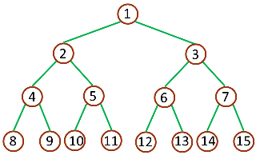
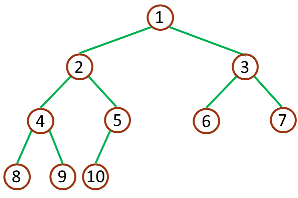
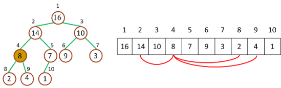

## 算法原理
先上一张堆排序动画演示图片：    
    
图片来自维基百科    

1. 不得不说说二叉树
    要了解堆首先得了解一下[二叉树](https://zh.wikipedia.org/wiki/二叉树)，在计算机科学中，二叉树是每个节点最多有两个子树的树结构。通常子树被称作“左子树”（left subtree）和“右子树”（right subtree）。二叉树常被用于实现[二叉查找树](https://zh.wikipedia.org/wiki/二元搜尋樹)和[二叉堆](https://zh.wikipedia.org/wiki/二叉堆)。   
      
    二叉树的每个结点至多只有二棵子树（不存在度大于 2 的结点），二叉树的子树有左右之分，次序不能颠倒。二叉树的第 i 层至多有 2i - 1 个结点；深度为 k 的二叉树至多有 2k - 1 个结点；对任何一棵二叉树 T，如果其终端结点数为 n0，度为 2 的结点数为 n2，则n0 = n2 + 1。    
    
    
    树和二叉树的三个主要差别：    
    +  树的结点个数至少为 1，而二叉树的结点个数可以为 0
    +  树中结点的最大度数没有限制，而二叉树结点的最大度数为 2
    +  树的结点无左、右之分，而二叉树的结点有左、右之分
    
    二叉树又分为完全二叉树（complete binary tree）和满二叉树（full binary tree）    
    
    满二叉树：一棵深度为 k，且有 2k - 1 个节点称之为满二叉树    
        
    深度为 3 的满二叉树 full binary tree
    
    完全二叉树：深度为 k，有 n 个节点的二叉树，当且仅当其每一个节点都与深度为 k 的满二叉树中序    号为 1 至 n 的节点对应时，称之为完全二叉树    
        
    深度为 3 的完全二叉树 complete binary tree    
    
2. 什么是堆？    
    堆（二叉堆）可以视为一棵完全的二叉树，完全二叉树的一个“优秀”的性质是，除了最底层之外，每一层都是满的，这使得堆可以利用数组来表示（普通的一般的二叉树通常用链表作为基本容器表示），每一个结点对应数组中的一个元素。    
    
     如下图，是一个堆和数组的相互关系    
     
         
     堆和数组的相互关系    
     
     对于给定的某个结点的下标 i，可以很容易的计算出这个结点的父结点、孩子结点的下标：    
     + Parent(i) = floor(i/2)，i 的父节点下标    
     + Left(i) = 2i，i 的左子节点下标    
     + Right(i) = 2i + 1，i 的右子节点下标    
     
          
     
     二叉堆一般分为两种：最大堆和最小堆。    
     